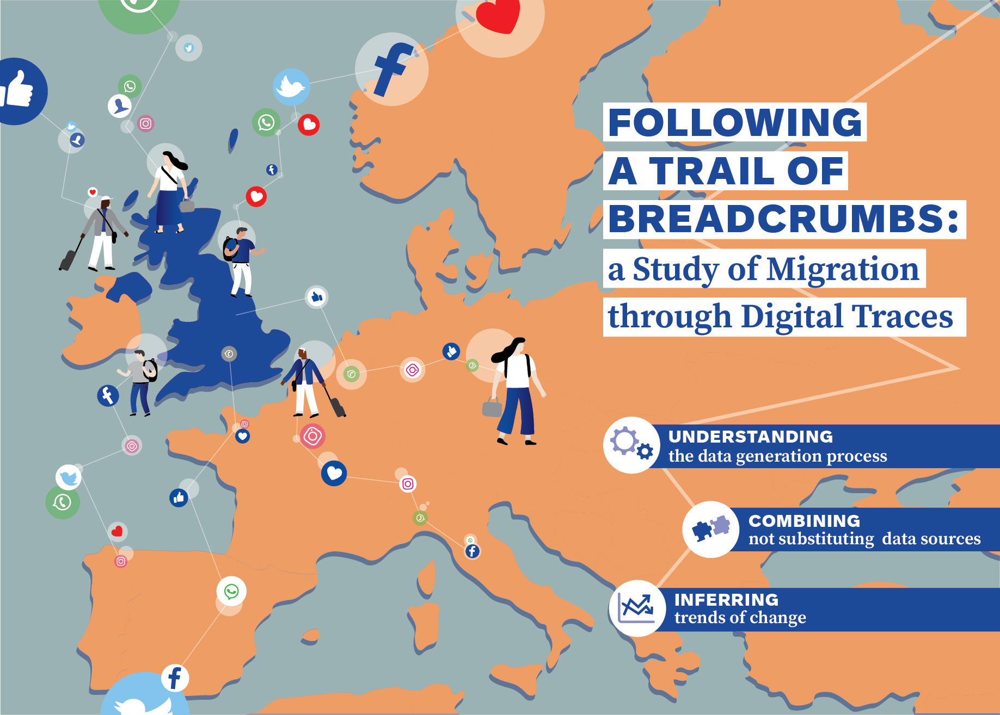

This is the first publication from Francesco Rampazzo's PhD thesis titled *Following a Trail of Breadcrumbs: a Study of Migration through Digital Traces*. 

This repository contains code and data for our paper on combining Facebook Advertising Platform data with survey data from the Labour Force Survey is presented.

Please, cite this work as: 

Rampazzo, F., Bijak, J., Vitali, A., Weber, I., and Zagheni, E. (Forthcoming). “*A Framework for Estimating Migrant Stocks Using Digital Traces and Survey Data: an Application in the United Kingdom*”. Demography. 

Or, if you modify and improve the code or use the data, please cite: 

Zenodo doi

## Code

You might need to install [Just Another Gibbs Sampler (Jags)](https://sourceforge.net/projects/mcmc-jags/files/latest/download) to run the code. 

There are three R file in the folder code: 

- model1.R contains the code for the model on the total number of European migrants; 

- model2.R contains the code for the model disaggregated by sex; 

- sensitivity.R contains the sensitivity tests presented in the paper as modifications of the model specified in model1.R. 

## Abstract

An accurate estimation of international migration is hampered by a lack of timely and comprehensive data, with different definitions and measures of migration adopted by different countries. Thus, we complement traditional data sources for the United Kingdom with social media data. Our aim is to understand whether information from digital traces can help measure international migration. The Bayesian framework proposed in the Integrated Model of European Migration is used to combine data from the Labour Force Survey (LFS) and the Facebook Advertising Platform in order to study the number of European migrants in the UK, aiming to produce more accurate estimates of European migrants. The overarching model is divided into a Theory-Based Model of migration, and a Measurement Error Model. We review the quality of the LFS and Facebook data, paying particular attention to the biases of these sources. The results indicate visible yet uncertain differences between model estimates using the Bayesian framework and individual sources. Sensitivity analysis techniques are used to evaluate the quality of the model. The advantages and limitations of this approach, which can be applied in other contexts, are also discussed. We cannot necessarily trust any individual source, but combining them through modelling offers valuable insights.

## Authors

- [Francesco Rampazzo](https://francescorampazzo.com) : [@chiccorampazzo](http://twitter.com/chiccorampazzo) | : [chiccorampazzo](https://github.com/chiccorampazzo)
- [Jakub Bijak](https://www.southampton.ac.uk/demography/about/staff/jb1d08.page)
- [Agnese Vitali](https://webapps.unitn.it/du/en/Persona/PER0212776/Curriculum) : [@agnevitali](https://twitter.com/agnevitali)
- [Ingmar Weber](https://ingmarweber.de)
: [@ingmarweber](https://twitter.com/ingmarweber) | :  [ingmarweber](https://github.com/ingmarweber)
- [Emilio Zagheni](https://www.zagheni.net/index.html) : [@ezagheni](https://twitter.com/ezagheni) | : [ezagheni](https://github.com/ezagheni)

This work was supported by the [Economic and Social Research Council](https://esrc.ukri.org) through the South Coast Doctoral Training Partnership ([Project:ES/P000673/1](https://gtr.ukri.org/projects?ref=studentship-1952202)).
